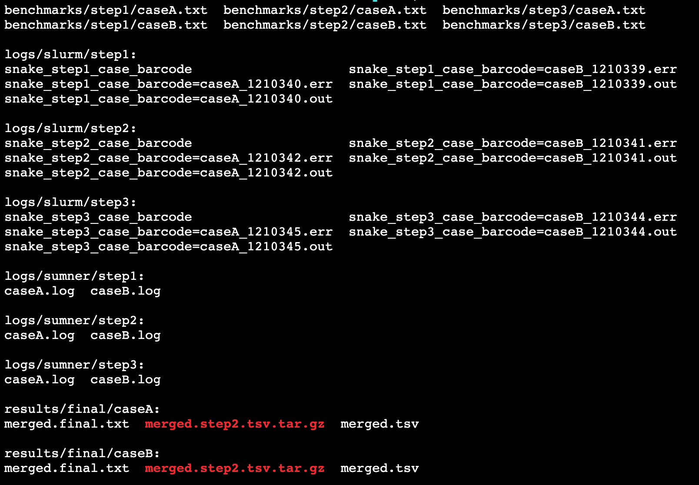

## snakemake toy example

Compliant with JAX HPC Sumner (Cent OS7) using slurm v18.08.8

#### To run

*   `ssh sumner` and clone this repository

```sh
mkdir -p ~/pipelines/snakemake
cd ~/pipelines/snakemake

git clone git@github.com:TheJacksonLaboratory/toymake.git
cd toymake
```

*   Edit `config.yaml` to match your username and valid path for `smk_home` and `workdir`.

*   Edit `Snakefile` to match your username (replace `amins`).

*   Setup slurm profile. [Read details here first](https://github.com/Snakemake-Profiles/slurm)

```sh
mkdir -p ~/.config/snakemake/sumner/
rsync -avhP ~/pipelines/snakemake/toymake/profile/sumner/ ~/.config/snakemake/sumner/
```

* Run workflow

```sh
./run_snakemake.sh |& tee -a run.log
```

* Expected output




_end_
